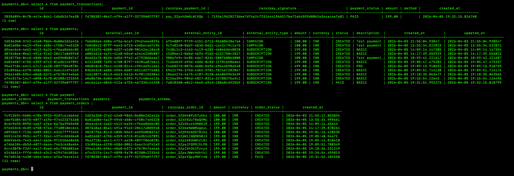

## 1. Payment Service Responsibilities
- Create payment
- Create Razorpay order
- Track payment state
- Handle webhook
- Store transactions

## 2. Define API contract 
### Request 
```java
package com.bouncenet.payment.dto;

import java.math.BigDecimal;
import java.util.UUID;

public record CreatePaymentRequest(
        UUID userId,
        UUID entityId,
        String entityType,
        BigDecimal amount,
        String currency
) {}
```

### Response
```java
package com.bouncenet.payment.dto;

import java.util.UUID;

public record CreatePaymentResponse(
        UUID paymentId,
        String razorpayOrderId,
        String status
) {}
```



## Razor pay create and verify PURELY Backend implementation
User pays in Razorpay popup
|
v
Razorpay sends POST to your /webhook/razorpay
with full payment details + signature
|
v
Your backend verifies signature + updates payment status
|
v
Frontend just shows success/failure (no verify call needed)


```java
@PostMapping("/razorpay")
public ResponseEntity<String> handleRzpWebhook(
        @RequestBody String payload,
        @RequestHeader("X-Razorpay-Signature") String rzpSignature
) {
    // Step 1: Verify webhook signature
    boolean isValid = Utils.verifyWebhookSignature(payload, rzpSignature, webhookSecret);
    if (!isValid) {
        return ResponseEntity.status(400).body("Invalid signature");
    }

    // Step 2: Parse payload
    JSONObject json = new JSONObject(payload);
    String event = json.getString("event"); // "payment.captured"

    if ("payment.captured".equals(event)) {
        JSONObject paymentEntity = json
            .getJSONObject("payload")
            .getJSONObject("payment")
            .getJSONObject("entity");

        String razorpayOrderId = paymentEntity.getString("order_id");
        String razorpayPaymentId = paymentEntity.getString("id");
        String razorpaySignature = rzpSignature;

        // Step 3: Find order and update status (same as your verifyPayment logic)
        paymentOrdersRepository.findByRazorpayOrderId(razorpayOrderId)
            .ifPresent(order -> {
                order.setOrderStatus(Status.PAID.getName());
                paymentOrdersRepository.save(order);
            });
    }

    // Step 4: Save raw event (already doing this)
    WebhookEvent event = new WebhookEvent();
    event.setPayload(payload);
    event.setProcessed(true);
    webhookEventRepository.save(event);

    return ResponseEntity.ok("OK");
}

```
## Need to update db table 
You'll also need findByRazorpayPaymentId on PaymentTransactionRepository for the refund handler — it doesn't exist yet. Add:

**Optional<PaymentTransaction> findByRazorpayPaymentId(String razorpayPaymentId);**


## webhook impl
To set this up on Razorpay Dashboard:

Go to Razorpay Dashboard → Settings → Webhooks

Add webhook URL: https://yourdomain.com/webhook/razorpay

Select event: payment.captured

Set a Webhook Secret and add it to your application.yml

Problem for local development:
Razorpay can't reach localhost:9700. You need a tunnel tool like ngrok:


## webhook secret 
It's different from razor-pay-secret.

You generate it yourself when setting up the webhook on Razorpay Dashboard:

Go to Razorpay Dashboard

Settings → Webhooks → Add New Webhook

Enter your webhook URL (e.g. https://abc123.ngrok.io/api/payment-service/webhook/razorpay)

You'll see a "Secret" field — you type any random string here (or Razorpay generates one)

Copy that same string and put it as webhook-secret in your application-razor.yml


## webhook key and secret
key                = webhook_secret
message            = webhook_body // raw webhook request body
received_signature = webhook_signature

expected_signature = hmac('sha256', message, key)

if expected_signature != received_signature
throw SecurityError
end